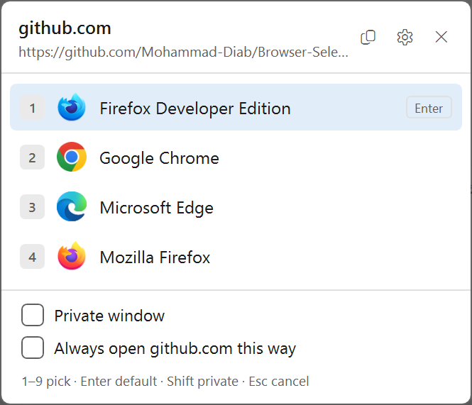
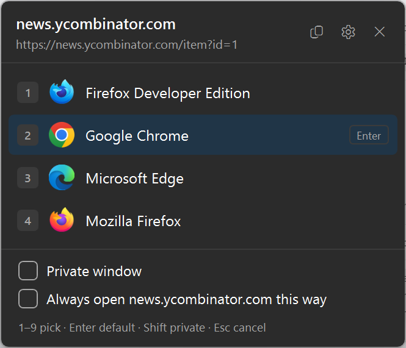
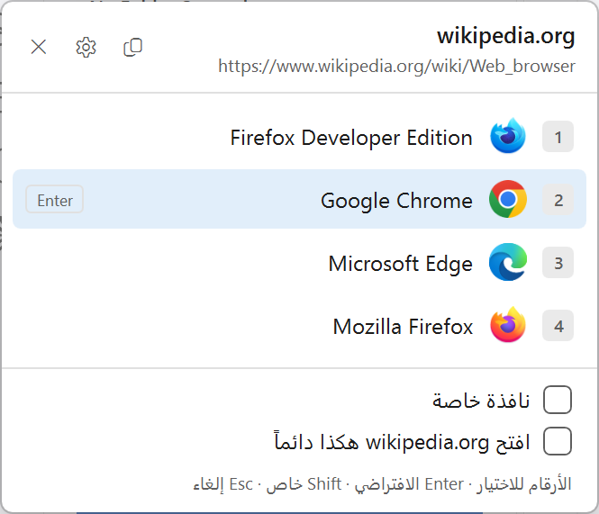
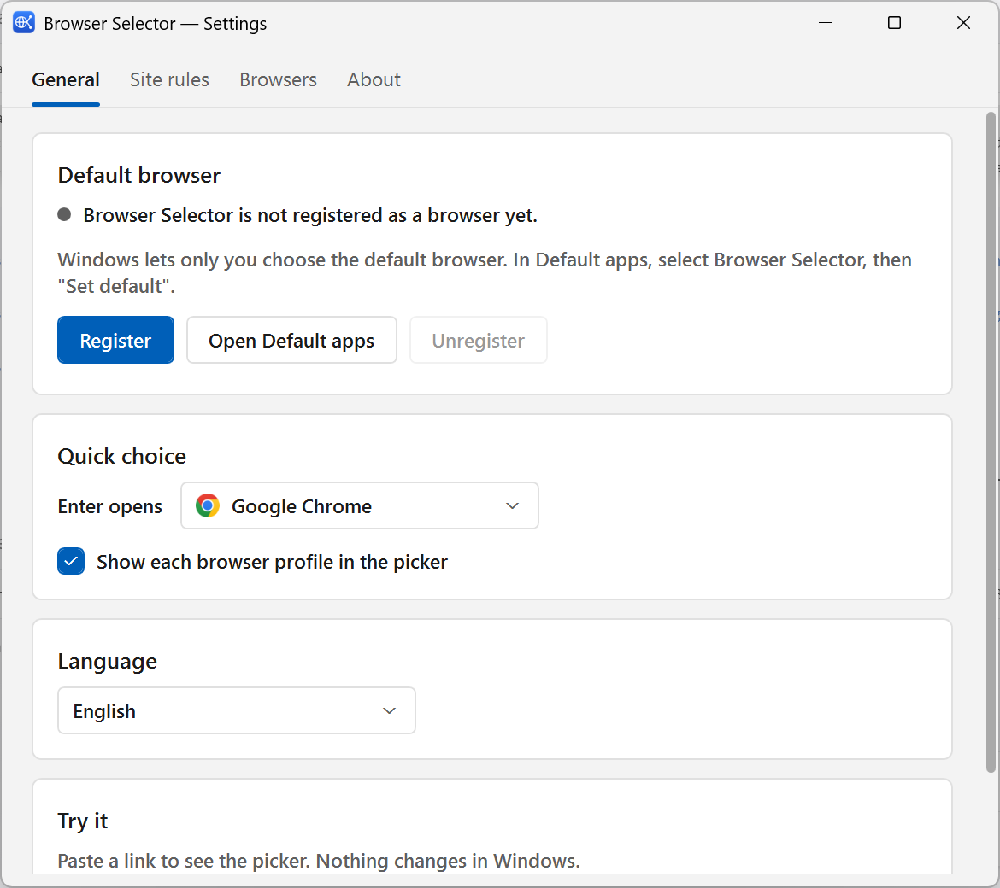
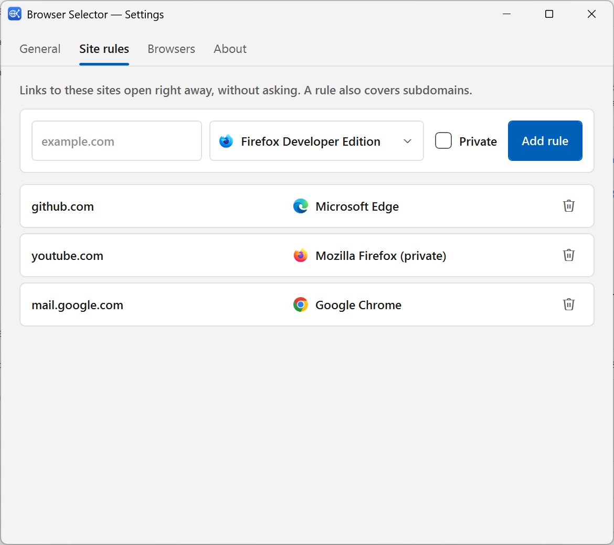

<p align="center"></p>

# Browser Selector

Pick the browser for every link. Make Browser Selector your default browser, and each link you
open asks which browser (and which profile) should open it. Sites you always open the same way
can skip the question.

<p align="center">
  
  
  
</p>

## Features

- **One simple choice**: ask every time, or open links in your main browser without asking, with
  site rules as the exceptions. Everything else waits under "Advanced options".
- **Finds your browsers by itself**: Chrome, Edge, Firefox, Brave, Vivaldi, Opera, and any other
  browser registered with Windows, with their icons.
- **A small, fast picker** that opens next to the mouse: press `1`–`9`, or `Enter` for your
  main browser, or `Esc` to cancel.
- **Site rules**: "Always open github.com this way" sends that site (and its subdomains) straight to
  a browser, without asking.
- **Profiles and private windows**: each Chrome/Edge/Brave/Vivaldi profile and each Firefox profile
  is its own entry; hold `Shift` for a private window.
- **No installer, no admin rights**: registration is per user (HKCU) and "Unregister" removes it all.
- **English and Arabic** (right-to-left), light and dark, following Windows.
- **Tiny**: one ~190 KB exe on .NET Framework 4.8, which is already part of Windows 10 and 11.

## Install

Download from the [latest release](https://github.com/Mohammad-Diab/Browser-Selector/releases):

| File | Use it when |
| --- | --- |
| `BrowserSelector-Setup-<version>.exe` | **Most people.** Installs for your user only (no admin), registers the app, adds a Start menu entry, and uninstalls cleanly from Apps & Features. |
| `BrowserSelector-<version>-portable.7z` | You want a portable copy (a USB stick, say). Settings stay in the folder. |
| `BrowserSelector.exe` | You just want the exe. Settings go to `%APPDATA%\BrowserSelector`. |

The files are not signed, so SmartScreen may warn you: choose **More info** → **Run anyway**.

With the portable copy or the plain exe, put it in a folder where it can stay: Windows remembers
the exe's path when you register, so after moving it, register again.

## Make it your default browser

Windows doesn't let apps make themselves the default browser, so this takes two clicks from you:

1. **Setup:** keep "Choose Browser Selector as my default browser now" ticked on the last page.
   **Portable / exe:** run `BrowserSelector.exe` (with no link it opens its settings) and click **Register**.
2. Windows opens **Settings → Apps → Default apps** (`ms-settings:defaultapps`).
   - **Windows 11:** select **Browser Selector**, then click **Set default** at the top.
   - **Windows 10:** under **Web browser**, click the current browser and choose **Browser Selector**.
3. Back in Browser Selector, the status reads "It is your default browser".

To stop using it, choose another default browser in Default apps, then uninstall it from
**Apps & Features** (Setup), or click **Unregister** and delete the folder (portable / exe).
Uninstalling removes the registration, and asks whether to delete your settings and site rules too.
`--unregister` only removes a registration that belongs to that copy (or to a copy that no longer exists).
From a script: `BrowserSelector.exe --register` and `BrowserSelector.exe --unregister`.

## Ask, or open in your main browser

**Settings → General → When you open a link** has two choices:

- **Ask me every time**: every link shows the picker. `Enter` opens your main browser.
- **Open it in my main browser**: links open straight away in the main browser you pick there,
  except sites that have a rule. To choose anyway, **hold `Shift`** while you open the link
  and the picker shows up.

Site rules apply in both cases.

<p align="center"></p>

## Using the picker

| Key | Action |
| --- | --- |
| `1` – `9` | Open with that browser or profile |
| `Enter` | Open with the highlighted entry (it starts on your main browser; arrows move it) |
| `Shift` + number, `Shift` + `Enter`, `Shift` + click | Open in a private window |
| `Ctrl` + `C` | Copy the link |
| `Esc`, or click anywhere else | Close without opening anything |

The **Try it** box under **Settings → General → Advanced options** tests any link without changing
anything in Windows: **Open picker** always asks, and **Open like a link** does what a real click
would (a site rule, your main browser, or the picker) and tells you which one it used.

## Site rules

Tick **Always open *site* this way** in the picker, or add a rule in **Settings → Site rules**.

- A rule for `github.com` also covers `gist.github.com`; the most specific rule wins.
- `www.` is ignored, so `www.youtube.com` and `youtube.com` are the same site.
- A rule can open a profile, and can open a private window.
- If a rule's browser or profile can't be found (uninstalled, or the profile deleted), the picker
  asks instead of guessing, and **Site rules** marks the rule. The same goes for the main browser.
- Firefox profiles are saved by folder, so renaming a profile doesn't break its rules.

<p align="center"></p>

## Profiles and private windows

| Browser | Profiles come from | Profile switch | Private switch |
| --- | --- | --- | --- |
| Chrome, Edge, Brave, Vivaldi, Chromium | `User Data\Local State` | `--profile-directory` | `--incognito` (Edge: `--inprivate`) |
| Opera | – | – | `--private` |
| Firefox, Firefox Developer Edition, LibreWolf, Waterfox, Floorp, Zen | `profiles.ini` | `-P` | `-private-window` |

A browser with only one profile shows as a single entry. Turn profiles off in
**Settings → General → Advanced options** to show one entry per browser.

## Settings file

Settings live in `%APPDATA%\BrowserSelector\settings.json`.
For a portable copy (on a USB stick, say), put a `settings.json` next to the exe; `{}` is enough
to start, and Browser Selector will keep its settings there.

If the file can't be read (a typo after editing it by hand, say), Browser Selector moves it aside as
`settings.json.bad-<date>-<time>`, tells you where it is, and starts from defaults. Your rules are still
in that file: fix it and rename it back.

## What it opens

Only web links (`http`, `https`) and local files. Anything else, such as `javascript:`, `data:`,
other apps' links or files on network shares, is refused, so another program can't use
Browser Selector to hand those to a browser.

## What it changes in Windows

Only when you click **Register**, and only for your user account:

- `HKCU\Software\Clients\StartMenuInternet\BrowserSelector` (with `Capabilities` for http, https, .htm and .html)
- `HKCU\Software\RegisteredApplications` → `Browser Selector`
- `HKCU\Software\Classes\BrowserSelectorURL` and `BrowserSelectorHTML` (ProgIDs)
- `HKCU\Software\Classes\.htm\OpenWithProgids` and `.html\OpenWithProgids`

**Unregister** deletes all of them.

## Build

You need Windows and the [.NET SDK](https://dotnet.microsoft.com/download) 8 or newer
(the .NET Framework 4.8 reference assemblies are downloaded during restore), or Visual Studio 2022+.

```
git clone https://github.com/Mohammad-Diab/Browser-Selector
cd Browser-Selector
dotnet build Browser-Selector.sln -c Release
```

The app is `Browser-Selector\bin\Release\net48\BrowserSelector.exe`.

To build all release files (exe, portable 7z and Setup) into `release\`, with
[7-Zip](https://www.7-zip.org/) and [Inno Setup 6](https://jrsoftware.org/isinfo.php)
(`winget install JRSoftware.InnoSetup`) installed:

```
powershell -ExecutionPolicy Bypass -File tools\build-release.ps1
```

The installer script is `installer\BrowserSelector.iss`; the version comes from
`<InformationalVersion>` in the project file. The icon is drawn by `tools/make-icon.py`
(Python with Pillow).

## License

[MIT](LICENSE) © 2024-2026 Mohammad Diab
